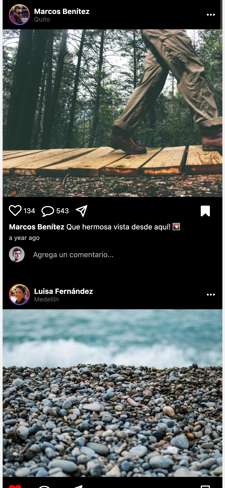
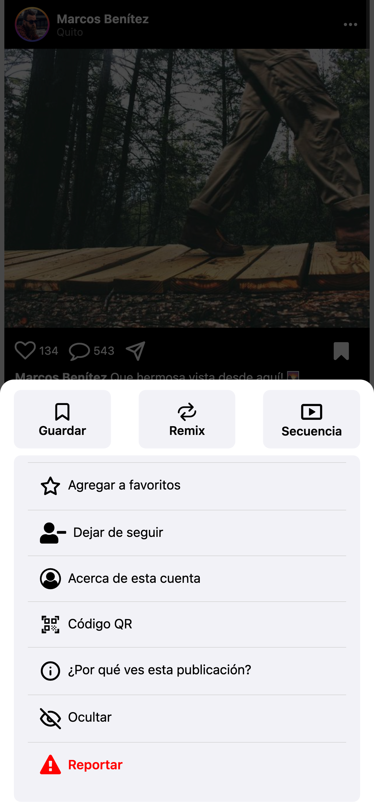

# 📸 My Instagram Clone - React Native

Este proyecto es una **réplica básica de Instagram** construida con **React Native**, con el propósito de demostrar mis habilidades en desarrollo móvil, diseño de interfaces y estructura de proyectos modernos.

## 🚀 Funcionalidades principales

- 📷 Feed con publicaciones (mock + API)  
- ❤️ Likes y comentarios simulados  
- 💾 Guardar publicaciones  
- 🎛 Modal de opciones con swipe  
- 👤 Avatares y nombres dinámicos  
- 🧭 Navegación tipo Bottom Tabs  
- 🔍 Modal de imagen en pantalla completa con zoom y swipe para cerrar  

## 🌐 Soporte Web Responsivo

- La pantalla principal (`HomeScreen`) está diseñada para que en pantallas grandes (como en navegador web o tablets) el contenido mantenga un **ancho máximo de 420px**, similar al tamaño de un teléfono móvil grande.  
- Esto permite que la app se vea centrada y con proporciones reales en cualquier dispositivo, mejorando la experiencia de usuario y manteniendo coherencia visual.  
- Se usa un contenedor con estilos responsivos para lograr esta adaptación sin afectar la experiencia en dispositivos móviles.

## 🖼 Capturas de pantalla

### 🏠 Pantalla principal (HomeScreen)  


### 🎛 Modal de opciones  


### 🔍 Vista detalle con zoom  


## 🧰 Tecnologías utilizadas

- React Native + TypeScript  
- Zustand (manejo de estado)  
- Axios (consumo de API)  
- react-native-vector-icons (iconografía)  
- react-native-modal (modales elegantes)  
- react-native-image-zoom-viewer (zoom en imágenes)  
- Faker (mock de datos realistas)  

## ▶️ Cómo ejecutar

```bash
npm install
npx expo start
```

o si usas yarn:

```bash
yarn
npx expo start
npm run web

y si tienes disponible XCode
npm run ios

o si tienes disponible Android Studio
npm run android
```

## 🎯 Objetivo

Este proyecto fue creado como una muestra técnica de mis capacidades como desarrollador mobile front-end, enfocándome en buenas prácticas, componentes reutilizables, tipado con TypeScript y una interfaz visualmente atractiva.

## 👨‍💻 Autor

- **Gabriel Witt**
- GitHub: [@GabrielWitt](https://github.com/GabrielWitt)

---

Gracias por visitar este repositorio 🙌